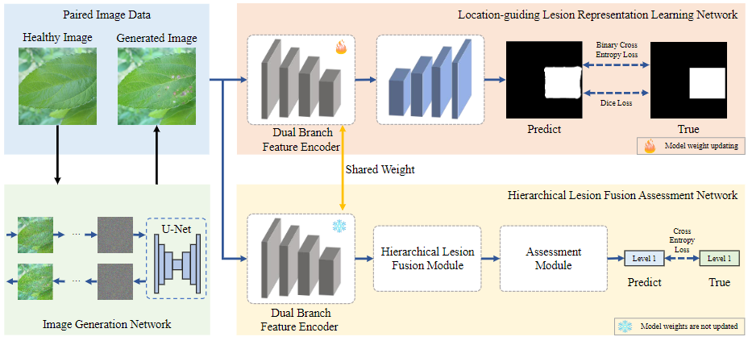
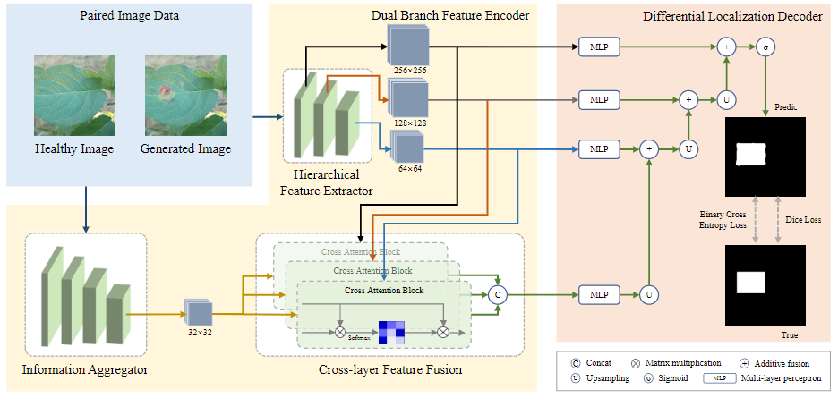
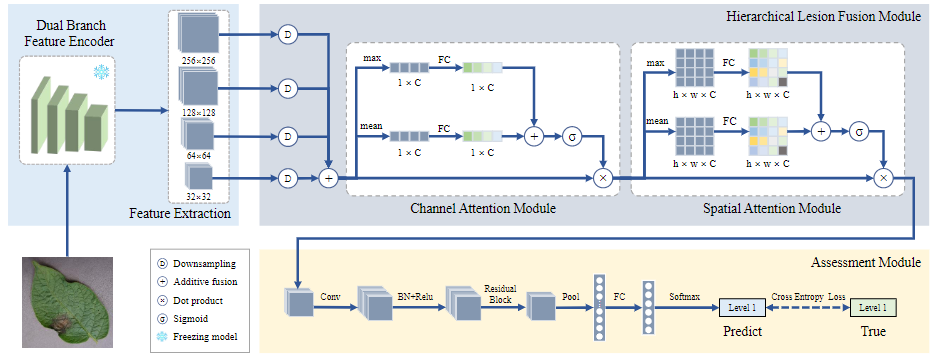
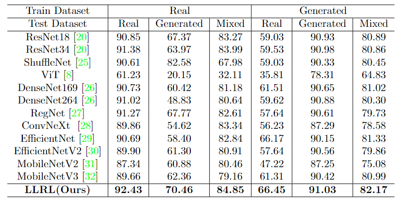

# LLRL
Location-guided Lesions Representation Learning via Image Generate for Assessing Plant Leaf Diseases Severity
# Abstract
Accurate assessment of plant leaf disease severity is crucial for implementing precision pesticide application, which in turn significantly enhances crop yields. Previous methods primarily rely on global perceptual learning, often leading to the misidentification of non-lesion regions as lesions within complex backgrounds, thereby compromising model accuracy. To address the challenge of background interference, we propose a novel location-guided lesion representation learning method (LLRL) based on image generation to assess the severity of plant leaf diseases. Our approach comprises three key networks: the image generation network (IG-Net), the location-guided lesion representation learning network (LGR-Net), and the hierarchical lesion fusion assessment network (HLFA-Net). IG-Net is designed to construct paired images necessary for LGR-Net by utilizing a diffusion model to generate diseased leaves from healthy ones. First, the LGR-Net facilitates the network's focus on the lesion area by contrasting paired images: healthy and diseased leaves, obtaining a pre-trained dual-branch feature encoder (DBF-Enc) that incorporates lesion-specific prior knowledge, providing focused visual features for HLFA-Net. Second, the HLFA-Net, which shares and freezes the DBF-Enc, further fuses and optimizes the features extracted by DBF-Enc, culminating in a precise classification of disease severity. In addition, we construct an image dataset containing three plant leaf diseases from apple, potato, and tomato plants, with a total of 12,098 photos, to evaluate our approach. Finally, experimental results demonstrate that our method outperforms existing classification models, with at least an improvement of 1\% in accuracy for severity assessment, underscoring the efficacy of the LLRL method in accurately identifying the severity of plant leaf diseases.

# Framework


# LGR-Net


# HLFA-Net


# Environment
You can create a new Conda environment by running the following command:
```
    pip install -r requirements.txt
```

# Dataset
<ul>
<li> FD-PDC [Link](https://github.com/GZU-SAMLab/LLRL/tree/main/dataset)</li>
</ul>

# PreTrained Model


# Inference
```
python ./main/mainClassifierVal.py --num_class 6 \
      --data-path ./datset \
      --model-path ./weight/resultClassifier/real_model1.pth
```


# Result

